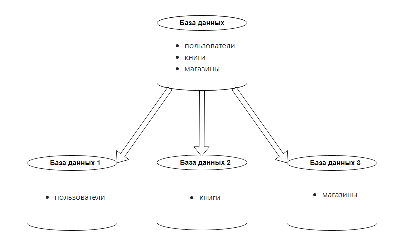
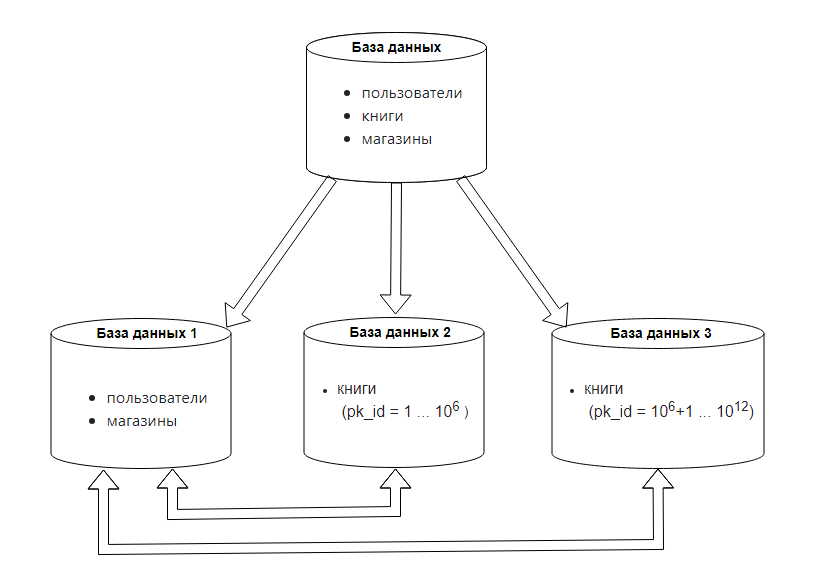

# "Домашнее задание к занятию «Репликация и масштабирование. Часть 2»" - Файзиев Давлат.

### Задание 1

Опишите основные преимущества использования масштабирования методами:
- активный master-сервер и пассивный репликационный slave-сервер; 
- master-сервер и несколько slave-серверов;
- активный сервер со специальным механизмом репликации — distributed replicated block device (DRBD);
- SAN-кластер.

*Дайте ответ в свободной форме.*

### Решение 1

Методы масштабирования и их примущества:
- активный master-сервер и пассивный репликационный slave-сервер: 

  высокая доступность и целостность данных между двумя серверами в случае сбоев

- master-сервер и несколько slave-серверов:

  отказоустойчивость, производительность, распределение нагрузки между серверами
 
- активный сервер со специальным механизмом репликации — distributed replicated block device (DRBD):

  согласовваность данных, репликация в реальном времени, быстрое переключение между серверами в случае сбоя

- SAN-кластер:

  отказоустойчивость, доступность, производиетльность, надежность, масштабируемость 
---
### Задание 2

Разработайте план для выполнения горизонтального и вертикального шаринга базы данных. База данных состоит из трёх таблиц: 

- пользователи, 
- книги, 
- магазины (столбцы произвольно). 

Опишите принципы построения системы и их разграничение или разбивку между базами данных.

*Пришлите блоксхему, где и что будет располагаться. Опишите, в каких режимах будут работать сервера.* 

### Решение 2

Блок схемы:

Вертикальный шардинг

Горизонтальный шардинг

---
